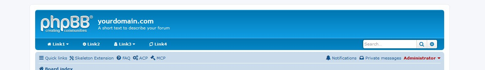

# xSensei - xDojo Navbar
#### Extension Version: 2.0.0  

_**Desktop Version**_  
 

_**Mobile Version**_  

**Description:** xSensei Navigation Menu xDojo Style. Super customizable navigation menù for phpbb. Thousand color combinations and easy to config. That is a style extension, so there isn't any ACP mudule o panel cor config. Simply to use and config. In a near future will be the possibility to have a small ACP module for customize the colors and probably the menu. 100% responsive!!!! No JS used! **Now we have a multi level menu, external link indication, images into wide links and a bottom link"

_Inspired form **phpbb Nav Menu** and totally rewritted from scratch in jade/sass. You can use this menu in both ways: single menu level, or multilevel_

_Next, on the Extension site a very usefull tool to calculate the color easly as possibile and viewing the preview_

**Author:** [Sir Xiradorn](https://github.com/Xiradorn "Tony Frost") (@Xiradorn)

**Requirements:**  
* ***phpBB 3.1.x*** or ***phpBB 3.2.x***  

**Repository:** xDojo Navbar - https://github.com/XiradornLab/phpbb_ext_xdojonavbar  
**Release Download:** xDojo Navbar - https://github.com/XiradornLab/phpbb_ext_xdojonavbar/releases  

**Features:**  
* navigation bar nice and clear for phpbb 3.1 or 3.2
* fully responsive
* no js used
* thousand of color mix for customize the bar apperance without any image. CSS3 gradient.
* font-awesome icon for customize the nav links
* CSS minified for super speed load

**For Developers:**  
* written in JADE (PUG) and SASS
* thare is a config var for develop a super lightweight version of css. 

#### Installation:  
* Download the latest release from (https://github.com/XiradornLab/phpbb_ext_xdojonavbar/releases).
* Unzip the downloaded release, and change the name of the folder to `xdojonavbar`.
* In the `ext` directory of your phpBB board, create a new directory named `xiradorn` (if it does not already exist).
* Copy the `xdojonavbar` folder to `/ext/xiradorn/` (if done correctly, you'll have the main extension class at (your forum root)/ext/xiradorn/xdojonavbar/composer.json).
* Navigate in the ACP to `Customise -> Manage extensions`.
* Look for `xDojo Navbar` under the Disabled Extensions list, and click its `Enable` link.[/list]

#### Update Instructions:  
* disable the extension
* delete extension data
* delete extension files from server
* download latest extension files from GitHub (if you haven't already)
* upload new files to the server
* enable extension
* in some cases, the board cache needs to be cleared

**Style Support:**  
Currently it perfectly work on prosilver and prosilver Special Edition. Other style will be probably added in future.  

**Permissions:**  
Ftp permission for customization process.  

----    
## Customization Process:  
Follow the step for customize the menu.  
**Link Customization:** For add, remove, customize the menù li, you can open this file `(your forum root)/ext/xiradorn/xdojonavbar/styles/prosilver/template/xdojonavbar.html` and then add, remove or customize those lines

	<li><a href="#link1"><i class="fa fa-home"></i> link1</a></li>

and change as you wish. For example i want use this link `http://example.com/home` so i can edit link in this way.

	<li><a href="http://example.com/home"><i class="fa fa-home"></i> Home</a></li>

You can also customize the near icon. Check the icon list. Click here: [Font-Awesome](https://fontawesome.com/)

**Color Customization:** for customize colors, you can open the same file said before, `(your forum root)/ext/xiradorn/xdojonavbar/styles/prosilver/template/xdojonavbar.html`. So we can change two parameters.
* Color
* Color tone

**Color:** First of all try to change the primary color to the `orangered` color. So find this slice of code

	

and use this class `xdojonav_COLORNAME` where COLORNAME is the web name of the color (https://en.wikipedia.org/wiki/Web_colors). There are lots of them. Soon the complete list of color. So the code for this case is the follow

	

That's it!!! Cool eh.  

**Color tone:** thare is so much color. But we also darken or lighten the color. For that task we can open the same file as before. For EVERY color we also have the possibility to make darker or lighter the color chosen in 25 different dark/light variation.  
_Darken color:_ I suppose to change the orangered in a more dark tone of that. So find the line modified before

	

So at this point i use a similar class with a number (**NUM**) from 1 to 25 like this `xdojonav_COLORNAME_NUM`. **IMPORTANT** you must use the same color as the previous class. So we can edit this line like this

	

End!!!!  

_Lighten color:_ Same procedure as before, just small different class. The class is that `xdojonav_COLORNAME_light_NUM`. So the line of code can be modified like that

	

**SUPER IMPORTANT:** The can't darken and lighten the bar at the same time. Is uneffective!  

----

## Update - Sublevel menu customization  
This step is a bit more complicated, but not so much. First i want show the difference between a single line menu and a multilevel step. So the single line is just this piece of code:  

	<li><a href="#link1"><i class="fa fa-home"></i> Link1 <i class="fa fa-caret-down"></i></a></li>

Instead a multilevel menu in build this way:

	<li><a href="#link1"><i class="fa fa-home"></i> Link1 <i class="fa fa-caret-down"></i></a>
		

			<ul class="wide_under">
				<li class="ext_link"><a href="#sublinkwide">
					<h4>Testo</h4>
					
Example of description for link.
</a>
				</li>
			</ul>
			<ul>
				<li>
					<a href="#sublink1">
						<h4>Testo</h4>
						
Lorem ipsum dolor sit amet consectetur adipisicing elit. Ullam, praesentium!

					</a>
				</li>
				<li>
					<a href="#sublink2">
						<h4>Testo</h4>
						
Lorem ipsum dolor sit amet consectetur adipisicing elit. Ullam, praesentium!

					</a>
				</li>
			</ul>
			<ul>
				<li>
					<a href="#sublink1">
						<h4>Testo</h4>
						
Lorem ipsum dolor sit amet consectetur adipisicing elit. Ullam, praesentium!

					</a>
				</li>
				<li>
					<a href="#sublink2">
						<h4>Testo</h4>
						
Lorem ipsum dolor sit amet consectetur adipisicing elit. Ullam, praesentium!

					</a>
				</li>
			</ul>
		
<a href="#bottomlink">... just a fast link <i class="fa fa-angle-double-right"> </i></a>

		

	</li>

Complex structure? Not so much. In this example there is all possibility for customize the second level. In particular this is an example of a submenu with 2 column. We also have a 3 cols menu using this class `xdojonav_underhover_xl` instead of using the normal `xdojonav_underhover`. So in this case we have a 3 columns in this way (or a unique row long over 3 cols)

			<ul>
				<li>
					<a href="#sublink1">
						<h4>Testo</h4>
						
Lorem ipsum dolor sit amet consectetur adipisicing elit. Ullam, praesentium!

					</a>
				</li>
				<li>
					<a href="#sublink2">
						<h4>Testo</h4>
						
Lorem ipsum dolor sit amet consectetur adipisicing elit. Ullam, praesentium!

					</a>
				</li>
				<li>
					<a href="#sublink3">
						<h4>Testo</h4>
						
Lorem ipsum dolor sit amet consectetur adipisicing elit. Ullam, praesentium!

					</a>
				</li>
			</ul>

