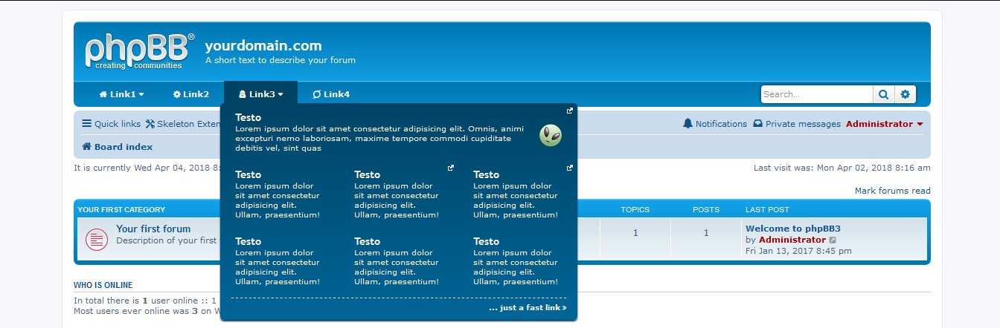

# xDojo Navbar
#### Extension Version: 1.0.0  

_**Desktop Version**_  
 

_**Mobile Version**_  

**Description:** Navigation Menu xDojo Style. Super customizable navigation menù for phpbb. Thousand color combinations and easy to config. That is a style extension, so there isn't any ACP mudule o panel cor config. Simpli to use and config. In a near future will be the possibility to have a small ACP module for customize the colors and probably the menu. 100% responsive!!!! No JS used!  

**Author:** [Sir Xiradorn](https://github.com/Xiradorn "Tony Frost") (@Xiradorn)

**Requirements:**  
* ***phpBB 3.1.x*** or ***phpBB 3.2.x***  

**Repository:** xDojo Navbar - https://github.com/XiradornLab/phpbb_ext_xdojonavbar  
**Release Download:** xDojo Navbar - https://github.com/XiradornLab/phpbb_ext_xdojonavbar/releases  

**Features:**  
* navigation bar nice and clear for phpbb 3.1 or 3.2
* fully responsive
* no js used
* thousand of color mix for customize the bar apperance without any image. CSS3 gradient.
* font-awesome icon for customize the nav links
* CSS minified for super speed load

**For Developers:**  
* written in JADE (PUG) and SASS
* thare is a config var for develop a super lightweight version of css. 

#### Installation:  
* Download the latest release from (https://github.com/XiradornLab/phpbb_ext_xdojonavbar/releases).
* Unzip the downloaded release, and change the name of the folder to `xdojonavbar`.
* In the `ext` directory of your phpBB board, create a new directory named `xiradorn` (if it does not already exist).
* Copy the `xdojonavbar` folder to `/ext/xiradorn/` (if done correctly, you'll have the main extension class at (your forum root)/ext/xiradorn/xbbcodesilkbtn/composer.json).
* Navigate in the ACP to `Customise -> Manage extensions`.
* Look for `xDojo Navbar` under the Disabled Extensions list, and click its `Enable` link.[/list]

#### Update Instructions:  
* disable the extension
* delete extension data
* delete extension files from server
* download latest extension files from GitHub (if you haven't already)
* upload new files to the server
* enable extension
* in some cases, the board cache needs to be cleared

**Style Support:**  
Currently it perfectly work on prosilver. Other style will be probably added in future.  

**Permissions:**  
Works with normal bbcode permission  

Thank you so much for all your suggestions.  